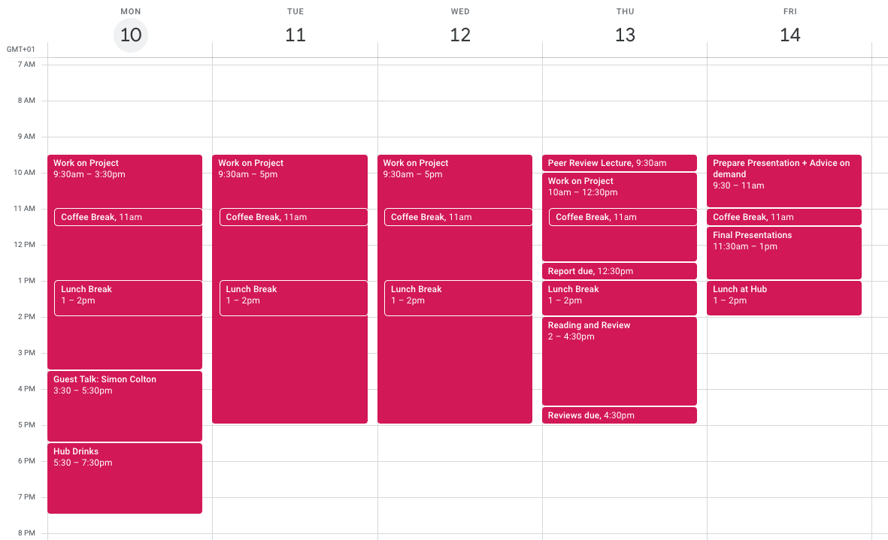

# IGGI AI based Game Design (Part II)

<a href="https://github.com/GAIGResearch/AIGD2/blob/master/IGGI%20AIGD2%20Basic%20Information.pdf?raw=true">Basic Information</a>

[Reading List](readinglist.md)

## Summary 

AI-based Game Design (Part II) extends the principles of game Design studied in Part I with the latest Artificial Intelligence techniques. This part of the module will cover state of the art AI methods that can be used for automatic game tuning, game design, and testing using AI agents and methods. During this module, you will learn these techniques, design your own game and participate in an AI hack. Finally, you will write all your work and experiments in a scientific paper and receive feedback in order to help you submit it to a conference. 

## Outline

The theme of this part of the course is AI Informed Game Design. The main aim is use AI to make better games, though attention will also be given to how we can design games to test important aspects of AI. What "better" means in this context can be hard to pin down, and in everyday terms is anyway a subjective measure. To make this more objective we'll consider aspects of player experience that can be measured and optimised. Since getting human players to play through games can be expensive and time consuming, we'll look at using software agents to automatically play test games.

A key aspect of the course is to consider how the design space of a class of games can be defined using appropriate data or program structures and then explored using automated search algorithms. Depending on how generally the search space is defined this approach can either be used to generate novel games, or it can be used to find the best set of parameters for a particular game.

The course will be taught with a mixture of lectures, labs (including game AI competitions) and group work.

## Schedule

**Week 1 (June 3th - June 7th)**

The **first week** is mostly lectures and labs, designed to introduce you to the concepts of using AI for Game Design. On Wednesday, we'll have two guest talks: Vanessa Volz and Mike Cook.

On Thursday we'll have the game AI Hack in which you, in teams, will work creating variants of the game Pommerman and AI agents to play them. We'll run a competition among all groups to determine which bot is the best one in all the desgined variants of the game. Finally, on Friday afternoon, we'll run a group forming and brainstorming session in which you can propose projects to work on, based on what you've seen during the week.

<a href="https://github.com/GAIGResearch/AIGD2/blob/master/img/Week1.png?raw=true" target="_blank">Enlarge</a>

**Week 2 (June 10th - June 14th)**

The **second week** will work as a Dagstuhl seminar. You'll form teams according to these projects and work on code and experimentation, to finally write a report in the form of a paper with your findings. On Monday, we'll have another guest speaker: Simon Colton. We'll end the week running a peer-review session among the groups in which you'll receive feedback from everybody else, so you can improve your paper.

Submissions and peer-reviews of these papers will be done via EasyChair: <a href="https://easychair.org/conferences/?conf=aigd2-2019">https://easychair.org/conferences/?conf=aigd2-2019</a>

<a href="https://github.com/GAIGResearch/AIGD2/blob/master/img/Week2.png?raw=true" target="_blank">Enlarge</a>

## Main topics

**Game Design Spaces:** Methods for parameterising a game and building a search space for:
 - game rules and parameters
 - input controls
 - game design
 - level designs
 
 
 **Toward quick and easy game AI:** The relevance of this is to generate a diverse set of agents to automatically play-test a game. This section will consider ways to quickly generate a number of reasonable performance AI players with relatively little effort. You may have already have covered many or even all the techniques below, but much can be learned by applying them to different games: there's still much to be learned regarding which methods work best and why:
 - Monte Carlo Tree Search
 - Rolling Horizon Evolutionary Algorithms
 - N-Tuple Bandit Evolutionary Algorithms

To study aspects of game design spaces, and also for your experimental work, we'll use a version of Pommerman (Java). You may also be able to use your own examples.

For some of the games used, reasonably efficient source code will be provided that can be run headless thousands of times faster than real time, enabling simulation-based search to be used to implement AI controllers. To test the various AI approaches mini-competitions will be run to see which team can generate the best performing AI, or the AI which best optimises some aspect of player experience.

**Defining and measuring aspects of player experience:** We'll run a lab on simple and more complex aspects of player experience which can be measured, and expriment with how sensitive these are to changes in the design of a game.

**Game A versus Game B:** One of your options is to work on a comparison between two (hopefully interestingly different) alternative games drawn. The experience that some software agents have playing these games will then be measured, with the aim of predicting how this relates to human player experience.

## Materials

**Lecture Slides:** 

[//]: #  (- <a href="https://github.com/GAIGResearch/AIGD2/blob/master/lectures/Introduction%202018.pptx?raw=true">Introduction</a>)
[//]: #  (- <a href="https://github.com/GAIGResearch/AIGD2/blob/master/lectures/Game%20Design%20Spaces%20with%20Videos%202018.pptx?raw=true">Game Design Spaces</a>)
[//]: #  (- <a href="https://github.com/GAIGResearch/AIGD2/blob/master/lectures/Game%20Parameter%20Tuning%20with%20NTBEA%202018.pptx?raw=true">Game Parameter Tuning with NTBEA</a>)
[//]: #  (- <a href="https://github.com/GAIGResearch/AIGD2/blob/master/lectures/Rolling%20Horizon%20Evolution%202018.pptx?raw=true">Rolling Horizon Evolution</a>)
[//]: #  (- <a href="https://github.com/GAIGResearch/AIGD2/blob/master/lectures/Fast%20Forward%20Models%202018.pptx?raw=true">Fast Forward Models</a>)
[//]: #  (- <a href="https://github.com/GAIGResearch/AIGD2/blob/master/lectures/MCTS%2BPTSP.pptx?raw=true">MCTS and PTSP</a>)
[//]: #  (- <a href="https://github.com/GAIGResearch/AIGD2/blob/master/lectures/GVGAI.pptx?raw=true">GVGAI</a>)
[//]: #  (- <a href="https://github.com/GAIGResearch/AIGD2/blob/master/lectures/Game%20AI%20Hack%202018.pptx?raw=true">Game AI Hack</a>)
[//]: #  (- <a href="https://github.com/GAIGResearch/AIGD2/blob/master/lectures/Peer%20Review.pptx?raw=true">Peer Review</a>)
 
**Labs:** 
[//]: #  -  ([Game Tuning](./labs/GameTuningLab2018.pdf))
[//]: #  -  ([Rolling Horizon Evolution](./labs/RollingHorizonLab2018.pdf))

**Game AI Hack:**

In 2019 we're using Pommerman. Each team develops their own agent, and their own custom arena. The repositoty is <a href="https://github.com/GAIGResearch/java-pommerman">here</a>.

**Extra Materials:**

- Suggested paper outline: <a href="https://github.com/GAIGResearch/AIGD2/blob/master/utils/PaperOutline.pdf?raw=true">PDF</a>
- Papers should be prepared in the AIIDE-2019 standard double-column format (6 pages of content plus 1 for references). Word and LaTeX templates are available <a href="http://www.aaai.org/Publications/Templates/AuthorKit19.zip">here</a>.
  - Group Presentation Marking Form <a href="https://github.com/GAIGResearch/AIGD2/blob/master/utils/GroupPresentationForm.docx?raw=true">docx</a>
  - For some general advice on scientific peer review, the links below are useful. Please keep in mind that not all the points apply to the peer review part of this course:
  - <a href="http://www.jmlr.org/reviewing-papers/p92-parberry.pdf">A Guide for New Referees in Theoretical Computer Science</a>
  - <a href="https://violentmetaphors.com/2013/12/13/how-to-become-good-at-peer-review-a-guide-for-young-scientists/">How to become good at peer review: A guide for young scientists</a>
- We encourage groups to revise their papers after the peer feedback and submit to a relevant conference. 2 papers have already been published as a result of this module in IGGI! <a href="https://github.com/GAIGResearch/AIGD2/blob/master/papers/NTupleBanditGameImprovement.pdf?raw=true">one</a> and  <a href="https://github.com/GAIGResearch/AIGD2/blob/master/papers/automatic-game-tuning.pdf?raw=true">two</a>.

## Assessment

Students are advised to work in groups (size 3 or 4).

**Deliverables:**

The deliverables are as follows. They should be packaged into a single .zip file and send to the instructors via email.
  - Report in the form of a short draft conference paper. The paper should include or be accompanied by a brief statement of the contribution of each author. Sumbit here: <a href="https://easychair.org/conferences/?conf=aigd2-2019">https://easychair.org/conferences/?conf=aigd2-2019</a>
  - Peer-review comments on the paper (peer review is by course participants). 
  - Code of the AI Hack and paper  
  - Data, if applicable, (game logs etc) underlying the results in the paper
  - Presentation slides

**Weighting:**

 - Game AI Hack: 10%
 - Group Presentation: 10%
 - Peer reviews: 20%
 - Final version of the paper: 60%

**Quiet Room:**
You can use Diego's room, CS.301 (near reception), at your disposal as a quiet room.

